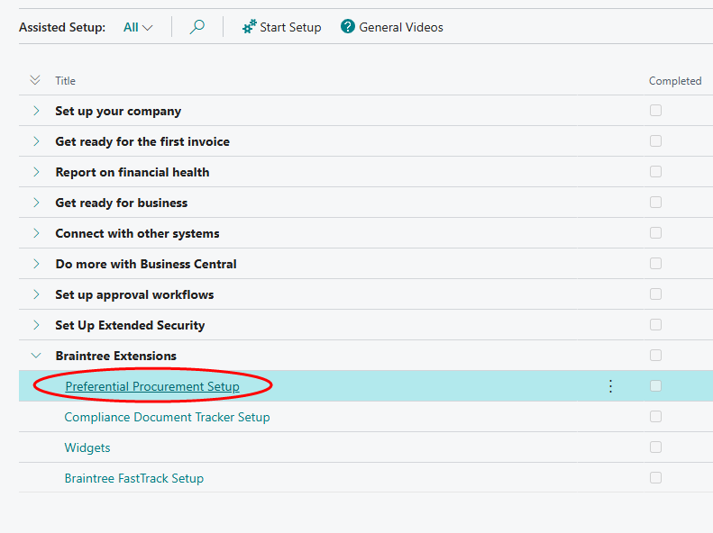
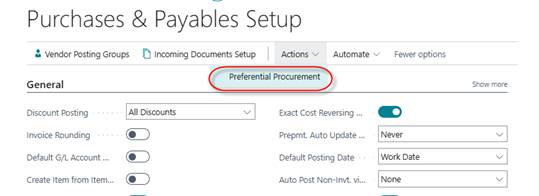
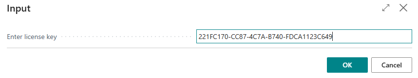
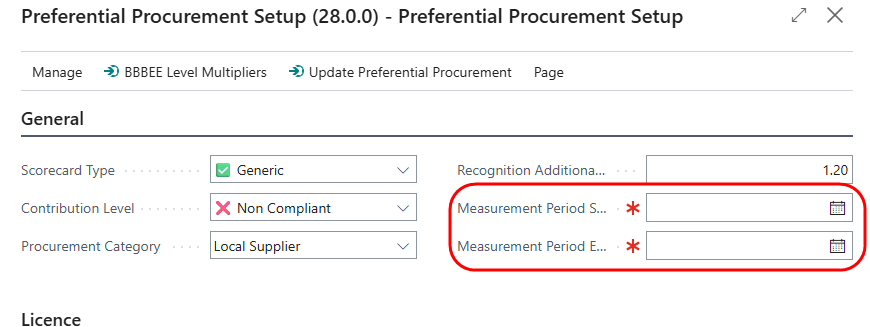

# Installation and Setup

## Installation from App Source
Open Business Central.
Search for Extension Management, and open the link.
From the Extension management page, click on 'AppSource Gallery'.

 
Search for Braintree Preferential Procurement.

Click on the application name. From the App overview page, click on Install App:

When the 'Install Extension' dialogue appears, click on Install:

### Licence registration
If your installation from AppSource is successful, the Preferential Procurement page will open.

You can also access the page from Assisted Setup:  

or from the Purchases and Payables Setup page.  From the Actions menu, select Preferential Procurement:

 

From the Preferential Procurement Setup page, select 'Request Registration':

A message will be sent to the Braintree Support desk. A licence key will be returned to you via email.

On the same page, select 'Activate License'. In the dialogue box, paste the key provided to you, then click OK:

 

Your app is now ready to use.

### Set up default options
From the Preferential Procurement setup page, you can optionally create default initial values for Scorecard Type, Procurement Category and Contribution Level.  These will be used as defaults for new vendors:

 

### Set Measurement Period
On the Setup page, you can set the starting and ending dates of your current B-BBEE cycle. These dates are used to calculate the preferential procurement spend on your vendors.

