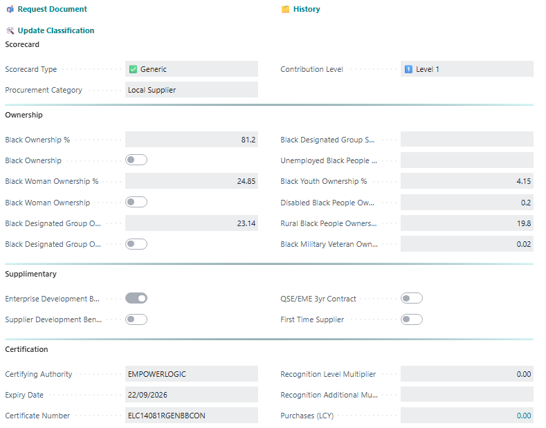
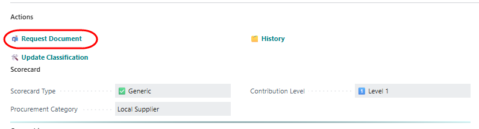
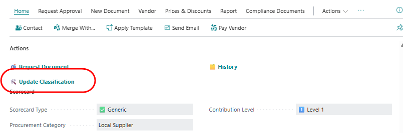
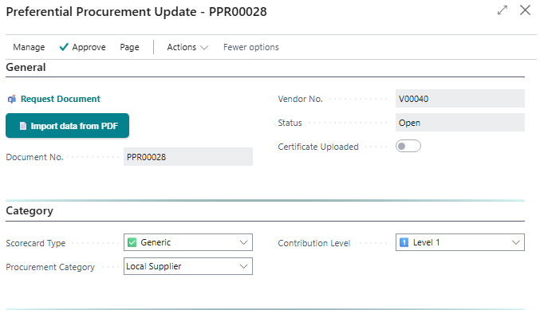

# Editing preferential procurement parameters on a vendor

- Go to the vendor list.
- Open a vendor Card.
- Scroll to the Preferential Procurement tab. 

This displays the current (most recent) B-BBEE credentials supplied by the vendor. 

## Request supplier to submit document
To request the supplier to submit their B-BBEE certificate, click on 'Request Document.

The Email dialogue will open. Update the sender address, and modify the message if required. Click 'Send email'.

## Create a new B-BBEE entry
From the Preferential Procurement section on the vendor card, click on Update Classification:

This opens the input page to capture and load new entries:

Each new entry is allocated a unique document number. The new entry will be populated with the most recently loaded details. You can now either edit the details. 

If the supplier's certificate is in readable PDF format, you may be able to load the data directly from the document Click on 'Import data from PDF', and select the stored file. If the system is able to read the file, the details will be entered into the page. Verify the details before continuing.

    PDF import has been tested with 
    - HoneyBEE 
    - EmpowerDex 
    - EmpowerLogic 
    Certificates issued by other B-BBEE auditors may not work reliably.

If you have configured an approval workflow for preferential procurement updates, click on 'Request Approval'. This will trigger the workflow process. If no workflow is in place, click on 'Approve'.

When you request approval, the system will verify that
- the date of issue and date of expiry have been entered
- the certifying body has been entered
- the certificate number has been entered.

If all details have been entered, the system will request confirmation before finally approving the entry. The new details will be updated to the Vendor card.

# Reviewing statistics
From the Vendor list, go to the Reports menu.
Select Preferential Procurement Statistics to review on the screen.

The report will open. You can use standard Business Central analysis mode to examine the data.

